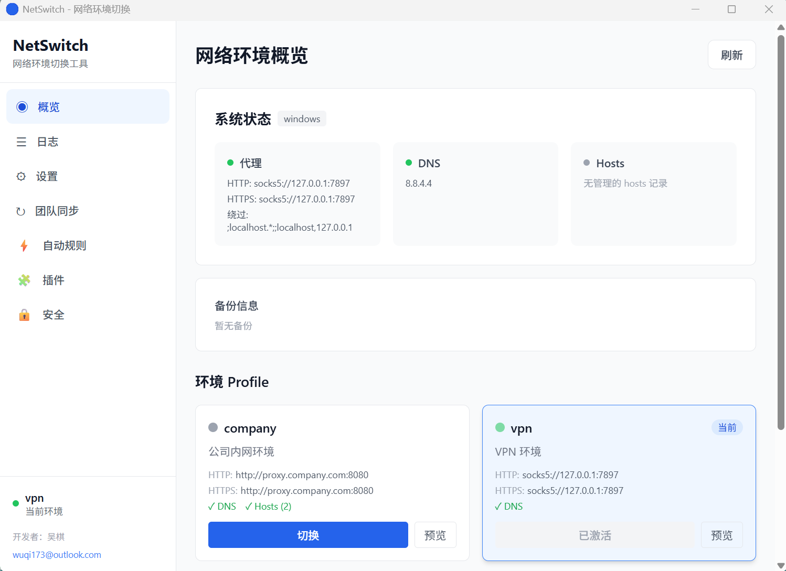
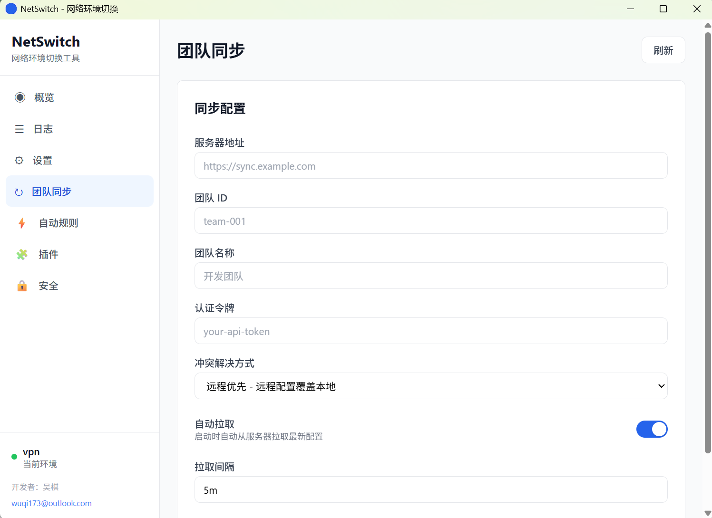
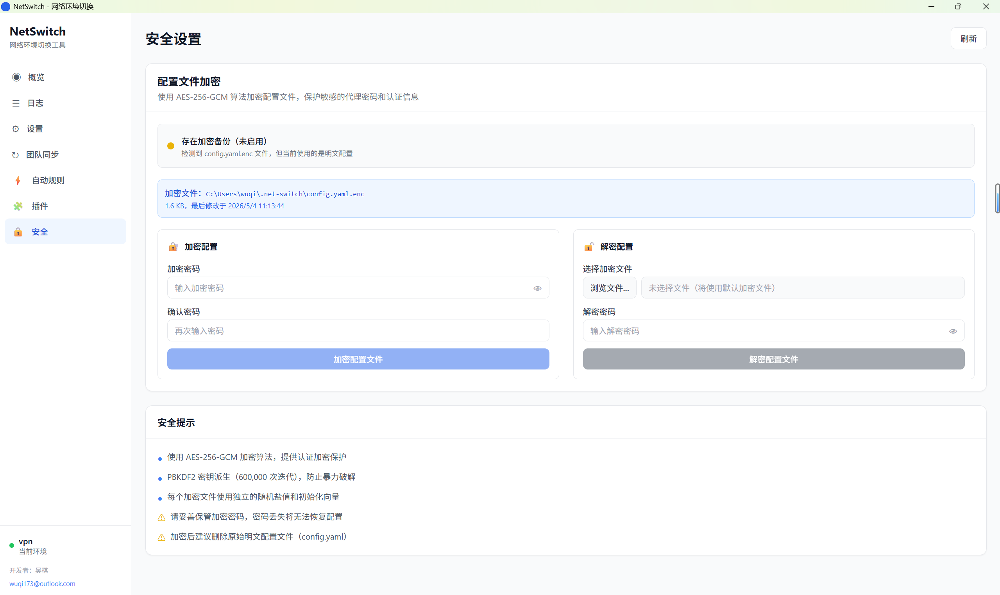
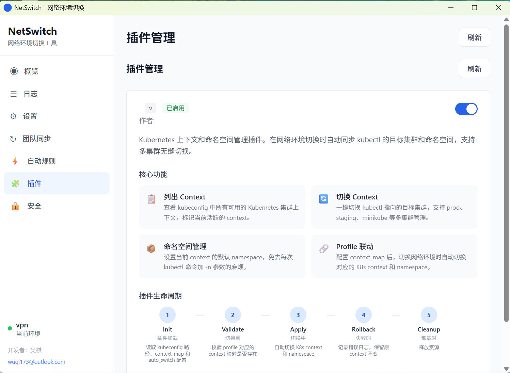
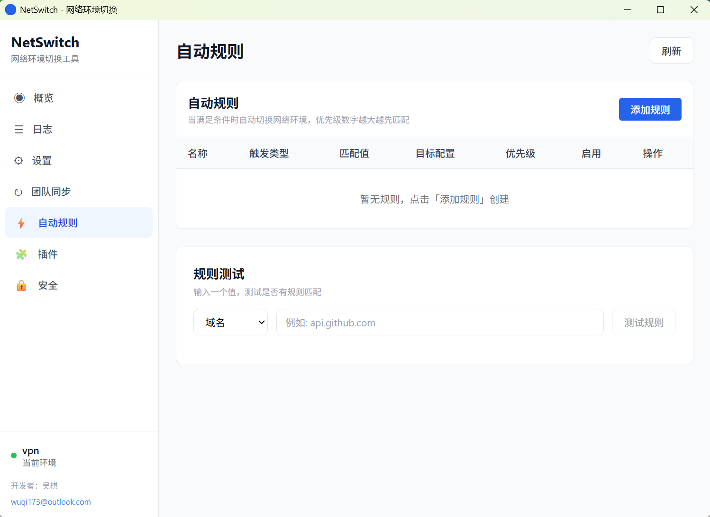
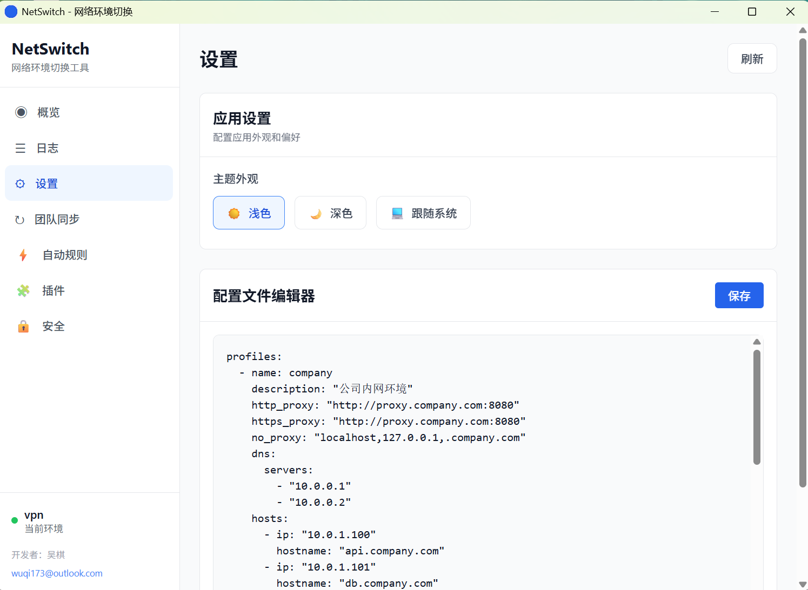

[English](README.md) | 中文

<h1 align="center">net-switch</h1>

<p align="center">
  <strong>开发者网络环境切换工具 — CLI + GUI，插件驱动，团队协作就绪。</strong>
</p>

<p align="center">
  <a href="https://golang.org"></a>
  <a href="https://github.com/wuqi789/net-switch/blob/main/LICENSE"></a>
  <a href="https://github.com/wuqi789/net-switch/releases"></a>
  <a href="https://github.com/wuqi789/net-switch/stargazers"></a>
  <a href="https://goreportcard.com/report/github.com/wuqi789/net-switch"></a>
</p>

<p align="center">
  <a href="#-快速开始">快速开始</a> &bull;
  <a href="#-安装">安装</a> &bull;
  <a href="#-gui-桌面应用">GUI</a> &bull;
  <a href="#-cli-使用">CLI 使用</a> &bull;
  <a href="#-配置文件">配置文件</a> &bull;
  <a href="#-插件系统">插件</a> &bull;
  <a href="#-架构">架构</a> &bull;
  <a href="#-参与贡献">参与贡献</a>
</p>

***

## 为什么选择 net-switch？

每个开发者每天都要在多个网络环境之间来回切换——办公时用公司代理，回家用直连，接入客户网络用 VPN 隧道，连远程集群用专属 DNS。每次切换都要手动修改 `HTTP_PROXY`、`HTTPS_PROXY`、`NO_PROXY`、DNS 服务器以及 `/etc/hosts` 文件。漏掉一个配置项，你可能要花上 30 分钟去排查一个"昨天还正常"的连接问题。再乘以你机器上所有遵循代理环境变量的工具（Docker、npm、pip、kubectl、git），这些重复劳动会迅速累积。

现有的变通方案五花八门——Shell 别名、脚本文件、平台专属 GUI——但它们都只解决了问题的某一个环节。没有一个方案能为你提供**统一的配置来源**来管理整个网络足迹——代理、DNS、hosts 以及各工具的专属配置——更不用说和团队共享配置、加密存储敏感信息、或根据你接入的 Wi-Fi 网络自动切换了。

**net-switch** 改变了这一切。在 YAML 文件中一次性定义你的网络环境，一条命令即可完成切换。通过规则自动检测上下文并自动切换。加密同步配置与团队共享。当你需要可视化总览时，启动桌面 GUI——所有功能来自同一个项目、同一份配置、同一个工作流。

***

## 功能特性

| 功能                   | 说明                                                     |
| :------------------- | :----------------------------------------------------- |
| ⚡ **一键切换**           | 一条 `net-switch use <profile>` 即可设置代理、DNS、hosts 和环境变量   |
| 🔌 **插件系统**          | 基于接口的架构，内置 EventBus、生命周期钩子和清单驱动的加载机制                   |
| 🔒 **配置加密**          | AES-256-GCM 字段级加密，PBKDF2 密钥派生——敏感信息存储无忧                |
| 🔄 **自动切换规则**        | 基于域名、IP、SSID 或进程检测自动触发配置切换                             |
| ☸️ **Kubernetes 集成** | 通过 CLI 列出、切换和管理 kubectl 上下文及命名空间                       |
| 👥 **团队同步**          | 通过 REST API 拉取/推送配置，支持冲突解决与合并策略                        |
| 🖥️ **GUI 桌面应用**     | Tauri v2 + React 18 + TypeScript + Tailwind CSS 原生桌面应用 |
| 🌐 **跨平台**           | Windows、macOS 和 Linux——支持 ARM64 和 AMD64                |
| 🧪 **预览模式**          | 使用 `--dry-run` 在执行前预览所有变更                              |
| 📜 **JSON 输出**       | 所有命令支持 `--format json` 机器可读输出，便于脚本和 CI 集成              |
| 🔑 **OAuth2 + PKCE** | 安全的团队认证，无需共享密码                                         |

***

## 安装

### 方式一：从源码构建 CLI 命令行工具

适合喜欢命令行操作的用户，轻量且快速。


#### 从源码构建

**前置条件:**
- [Go](https://golang.org/) 1.26 或更高版本

**步骤:**

```bash
# 克隆仓库
git clone https://github.com/wuqi789/net-switch.git
cd net-switch

# 直接使用Go构建
go build -o bin/net-switch ./cmd/netenv/
```

编译后的二进制文件位于 `bin/` 目录中。

## GUI 图形化界面功能

基于 **Tauri v2 + React 18 + TypeScript + Tailwind CSS** 构建的跨平台桌面应用。

### 应用截图

<table>
  <tr>
    <td align="center"><b>应用首页</b></td>
    <td align="center"><b>团队同步</b></td>
    <td align="center"><b>配置文件加密</b></td>
  </tr>
  <tr>
    <td></td>
    <td></td>
    <td></td>
  </tr>
  <tr>
    <td align="center"><b>插件管理</b></td>
    <td align="center"><b>自动规则</b></td>
    <td align="center"><b>配置管理</b></td>
  </tr>
  <tr>
    <td></td>
    <td></td>
    <td></td>
  </tr>
</table>

### 运行 GUI

GUI 源码位于独立仓库 `net-switch-gui`：

```
github.com/wuqi789/
├── net-switch/          # CLI 项目（本仓库）
└── net-switch-gui/      # GUI 项目（独立仓库）
```

**前置条件：**

- [Node.js](https://nodejs.org/) 18+
- [Rust](https://www.rust-lang.org/)（Tauri 后端需要）
- 已编译的 `net-switch` CLI 可执行文件


**步骤：**

```bash
# 1. 克隆 GUI 仓库
git clone https://github.com/wuqi789/net-switch-gui.git
cd net-switch-gui

# 2. 安装 GUI 依赖
npm install

# 3. 启动 GUI（开发模式）
npm run tauri dev
```

首次启动需要编译 Rust 后端，可能需要几分钟。之后增量编译会快很多。

***


功能亮点：

- 可视化配置文件管理，带状态指示
- 实时网络状态监控仪表盘
- 团队同步面板，拉取和推送配置
- 加密配置编辑，内置 YAML 编辑器
- 自动切换规则配置，可视化触发条件
- 插件管理，可视化生命周期
- 深色与浅色主题支持

## CLI 使用

### 列出配置文件

```bash
$ net-switch list
可用的网络环境:
─────────────────────────────────────
▸ company  -  公司内网环境
  vpn      -  VPN 环境
  test     -  测试环境
  direct   -  直连（无代理）
─────────────────────────────────────
使用 'net-switch use <profile>' 切换环境
```

JSON 输出，便于脚本处理：

```bash
$ net-switch list --format json
[
  {
    "name": "company",
    "description": "公司内网环境",
    "http_proxy": "http://proxy.company.com:8080",
    "https_proxy": "http://proxy.company.com:8080",
    "no_proxy": "localhost,127.0.0.1,.company.com",
    "has_dns": true,
    "hosts_count": 2
  }
]
```

### 预览模式切换

```bash
$ net-switch use company --dry-run
[DRY-RUN] Would apply profile: company
  HTTP_PROXY:  http://proxy.company.com:8080
  HTTPS_PROXY: http://proxy.company.com:8080
  NO_PROXY:    localhost,127.0.0.1,.company.com
  DNS:         [10.0.0.1 10.0.0.2]
  Hosts:       2 entries
```

### 正式切换

```bash
$ net-switch use company
✓ 已切换到: company
  描述: 公司内网环境
  HTTP_PROXY:  http://proxy.company.com:8080
  HTTPS_PROXY: http://proxy.company.com:8080
  NO_PROXY:    localhost,127.0.0.1,.company.com
  DNS:         [10.0.0.1 10.0.0.2]
  Hosts:       2 条记录
```

### 查看当前配置

```bash
$ net-switch current
Current profile: company
```

### 系统状态

```bash
$ net-switch status
Profile: company
HTTP Proxy: http://proxy.company.com:8080
HTTPS Proxy: http://proxy.company.com:8080
DNS: 10.0.0.1, 10.0.0.2
Hosts entries: 2
```

### 恢复上一次的状态

```bash
$ net-switch restore
✓ 已恢复到上一次的网络配置
```

### 加密 / 解密配置

```bash
$ net-switch encrypt
✓ 配置已加密（AES-256-GCM）

$ net-switch decrypt
✓ 配置已解密
```

### 自动切换规则

```bash
$ net-switch rules list
  NAME         ENABLED  TRIGGER         PROFILE
  office-wifi  true     SSID: CorpNet   company
  home-wifi    true     SSID: Home-5G   direct
  client-vpn   false    IP: 10.50.0.0/16  client

$ net-switch rules test "SSID: CorpNet"
✓ Matched rule: office-wifi → company

$ net-switch rules disable office-wifi
✓ Rule disabled: office-wifi
```

### 团队同步

```bash
$ net-switch auth login
✓ Logged in as: dev@company.com

$ net-switch sync pull
✓ Pulled 3 profiles from team server
  company (updated)
  staging (new)
  prod    (conflict — merged)

$ net-switch sync push
✓ Pushed 1 profile to team server
  home-dev (created)
```

### Kubernetes 上下文管理

```bash
$ net-switch k8s list
  CONTEXT            CLUSTER       NAMESPACE   CURRENT
  minikube           minikube      default     ✓
  prod-cluster       eks-prod      kube-system
  staging-cluster    eks-staging   default

$ net-switch k8s switch prod-cluster
✓ kubectl context switched to: prod-cluster

$ net-switch k8s ns monitoring
✓ Namespace set to: monitoring
```

### 插件管理

```bash
$ net-switch plugin list
  PLUGIN   VERSION  STATUS    DESCRIPTION
  k8s      0.1.0    active    Kubernetes context and namespace management
  echo     0.1.0    active    Example plugin that echoes profile switches

$ net-switch plugin info k8s
Name:        k8s-plugin
Version:     0.1.0
Author:      netenv
Description: Kubernetes context and namespace management plugin
Permissions: kubernetes, filesystem
Commands:    k8s list, k8s switch, k8s current, k8s ns
```

### 全局标志

```
--config string    配置文件路径（默认：./config.yaml 或 ~/.net-switch/config.yaml）
--dry-run          预览模式——显示将要发生的变更，不做实际修改
--format string    输出格式：text 或 json（默认：text）
```

***

## 配置文件

net-switch 从当前目录的 `./config.yaml` 或用户主目录的 `~/.net-switch/config.yaml` 读取配置。

```yaml
version: "1"
current_profile: company

profiles:
  - name: company
    description: "Corporate network"
    http_proxy: "http://proxy.corp.com:8080"
    https_proxy: "http://proxy.corp.com:8080"
    no_proxy: "localhost,127.0.0.1,.corp.com"
    dns:
      servers:
        - 10.0.0.53
        - 10.0.0.54
    hosts:
      - ip: 10.0.1.100
        hostname: "git.corp.com"
      - ip: 10.0.1.101
        hostname: "registry.corp.com"

  - name: home
    description: "Home network — no proxy"
    http_proxy: ""
    https_proxy: ""
    dns:
      servers:
        - 8.8.8.8
        - 1.1.1.1

  - name: cloud-dev
    description: "Cloud development cluster"
    http_proxy: "socks5://127.0.0.1:1080"
    https_proxy: "socks5://127.0.0.1:1080"
    no_proxy: "localhost,127.0.0.1,10.0.0.0/8"
    dns:
      servers:
        - 169.254.169.254
    hosts:
      - ip: 10.20.0.100
        hostname: "api.staging.internal"
      - ip: 10.20.0.101
        hostname: "db.staging.internal"
      - ip: 10.20.0.102
        hostname: "cache.staging.internal"

  - name: direct
    description: "Direct connection — no proxy, system DNS"
    http_proxy: ""
    https_proxy: ""
```

### 配置文件搜索顺序

1. `--config` 标志（最高优先级）
2. 当前工作目录下的 `./config.yaml`
3. `~/.net-switch/config.yaml`（用户主目录）

***

## 插件系统

net-switch 的插件架构基于清晰的 `Plugin` 接口构建，提供完善的生命周期钩子。

### 插件生命周期

```
Init → Validate → Apply → Rollback → Cleanup
```

| 阶段         | 执行时机  | 用途             |
| :--------- | :---- | :------------- |
| `Init`     | 插件加载时 | 注册命令、初始化资源     |
| `Validate` | 切换前   | 验证配置文件是否适用于该插件 |
| `Apply`    | 切换过程中 | 执行插件的切换逻辑      |
| `Rollback` | 发生失败时 | 撤销部分已完成的变更     |
| `Cleanup`  | 插件卸载时 | 释放资源           |

### 插件间通信

插件通过 **EventBus** 进行通信——这是一种发布/订阅系统，实现插件之间的解耦。插件可以发出事件（如 `profile.switched`），也可以订阅其他插件发出的事件。

### 内置插件

| 插件     | 说明                              |
| :----- | :-------------------------------- |
| `k8s`  | Kubernetes 上下文和命名空间管理插件         |
| `echo` | 回显配置切换事件的示例插件，用于测试和开发 |

### 编写插件

用 Go 实现 `Plugin` 接口，创建 `manifest.yaml`，将编译后的二进制文件放入插件目录即可。详见 [CONTRIBUTING.md](CONTRIBUTING.md) 完整指南。

```go
type Plugin interface {
    Manifest() Manifest
    Init(ctx PluginContext) error
    Cleanup() error
    Validate(profile *config.Profile) error
    Apply(ctx *ExecutionContext) error
    Rollback(ctx *ExecutionContext) error
}
```

***

## 架构

```
┌─────────────┐    ┌─────────────┐
│  CLI (cobra) │    │ GUI (Tauri) │
└──────┬──────┘    └──────┬──────┘
       │                   │
       └─────────┬─────────┘
                 │
       ┌─────────▼─────────┐
       │     Switcher       │
       │  (orchestration)   │
       └─────────┬─────────┘
                 │
    ┌────────────┼────────────┐
    │            │            │
┌───▼───┐  ┌────▼────┐  ┌────▼────┐
│Network│  │ Plugin  │  │ Crypto  │
│Manager│  │ System  │  │ Module  │
└───┬───┘  └────┬────┘  └─────────┘
    │           │
┌───▼───┐  ┌────▼────┐
│Windows│  │ K8s     │
│Linux  │  │ Rules   │
│macOS  │  │ Sync    │
└───────┘  └─────────┘
```

**分层概述：**

- **CLI / GUI** —— 两个入口共享同一套核心逻辑。CLI 使用 [cobra](https://github.com/spf13/cobra)；GUI 使用 Tauri + React 前端。
- **Switcher（切换器）** —— 编排层，协调配置文件在所有子系统中的应用。
- **Network Manager（网络管理器）** —— 平台专属实现，负责代理设置、DNS 配置和 hosts 文件管理。
- **Plugin System（插件系统）** —— 可扩展架构，内置 EventBus、清单驱动加载和基于权限的沙箱隔离。
- **Crypto Module（加密模块）** —— AES-256-GCM 加密，PBKDF2 密钥派生，保障配置安全。

***

## 与 CC-Switch 对比

| 功能        |    net-switch   | CC-Switch |
| :-------- | :-------------: | :-------: |
| CLI       |      ✅ 功能完整     |   ✅ 基础功能  |
| GUI       |   ✅ Tauri 桌面应用  |    ❌ 无    |
| 插件系统      |      ✅ 可扩展      |    ❌ 无    |
| 配置加密      |  ✅ AES-256-GCM  |    ❌ 无    |
| 自动切换规则    |   ✅ 域名/IP/SSID  |    ❌ 无    |
| K8s 集成    |     ✅ 上下文切换     |    ❌ 无    |
| 团队同步      |    ✅ REST API   |    ❌ 无    |
| OAuth2 认证 |    ✅ PKCE 流程    |    ❌ 无    |
| 跨平台       | ✅ Win/Mac/Linux |  ⚠️ 部分支持  |
| 配置格式      |      ✅ YAML     |  ⚠️ JSON  |
| 预览模式      |       ✅ 内置      |    ❌ 无    |
| JSON 输出   |      ✅ 所有命令     |    ❌ 无    |
| 开源        |      ✅ MIT      |  ⚠️ 混合授权  |

***

## 参与贡献

我们欢迎各种形式的贡献——Bug 报告、功能建议、文档改进和代码提交。

提交 Pull Request 前，请先阅读 [CONTRIBUTING.md](CONTRIBUTING.md)，其中涵盖：

- 开发环境搭建
- 代码风格与规范
- 插件开发指南
- 测试要求
- Pull Request 流程

### 快速搭建开发环境

```bash
git clone https://github.com/wuqi789/net-switch.git
cd net-switch
go build ./cmd/net-switch
./net-switch list
```

### 运行测试

```bash
go test ./...
```

***

## 许可证

本项目基于 **MIT 许可证** 开源——详见 [LICENSE](LICENSE) 文件。

```
MIT License

Copyright (c) 2024-2026 netenv

Permission is hereby granted, free of charge, to any person obtaining a copy
of this software and associated documentation files (the "Software"), to deal
in the Software without restriction, including without limitation the rights
to use, copy, modify, merge, publish, distribute, sublicense, and/or sell
copies of the Software, and to permit persons to whom the Software is
furnished to do so, subject to the following conditions:

The above copyright notice and this permission notice shall be included in all
copies or substantial portions of the Software.
```

***

<p align="center">
  Made with ❤️ by <a href="https://github.com/netenv">netenv</a>
  <br/><br/>
  <a href="https://github.com/wuqi789/net-switch/stargazers">⭐ 在 GitHub 上给我们 Star</a> &bull;
  <a href="https://github.com/wuqi789/net-switch/issues">报告 Bug</a> &bull;
  <a href="https://github.com/wuqi789/net-switch/discussions">参与讨论</a>
</p>

<p align="center">
  <strong>开发者: 吴棋</strong> &bull; <a href="mailto:wuqi173@outlook.com">wuqi173@outlook.com</a>
</p>
